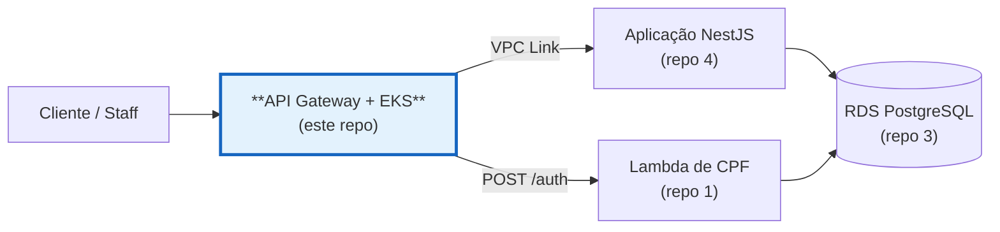

# soat-fiap-oficina-infra-k8s

[](https://github.com/guilhermeqmaia/soat-fiap-oficina-infra-k8s/actions/workflows/ci.yml) [](https://github.com/guilhermeqmaia/soat-fiap-oficina-infra-k8s/actions/workflows/cd.yml)

Terraform da infraestrutura de nuvem do **Sistema da Oficina Mecânica**
(Tech Challenge FIAP — Fase 3): API Gateway e, em breve, o cluster **Amazon
EKS**. Repositório **2/4** da solução.

| # | Repositório | Conteúdo |
|---|---|---|
| 1 | [soat-fiap-oficina-auth-lambda](https://github.com/guilhermeqmaia/soat-fiap-oficina-auth-lambda) | Function serverless de autenticação por CPF |
| 2 | **soat-fiap-oficina-infra-k8s** (este) | Terraform do API Gateway + cluster EKS |
| 3 | [soat-fiap-oficina-infra-db](https://github.com/guilhermeqmaia/soat-fiap-oficina-infra-db) | Terraform do banco gerenciado (RDS PostgreSQL) |
| 4 | [soat-fiap-oficina-mecanica-app](https://github.com/guilhermeqmaia/soat-fiap-oficina-mecanica-app) | Aplicação NestJS + manifestos K8s + docs |

## Onde este repositório entra



**Papel deste repositório:** API Gateway, cluster EKS (com HPA e metrics-server) e a stack de observabilidade — agentes, dashboards e alertas.

| Repositório | Papel |
|---|---|
| [1 · auth-lambda](https://github.com/guilhermeqmaia/soat-fiap-oficina-auth-lambda) | emite o JWT (CPF) e valida no gateway |
| **2 · este repo** | **API Gateway, cluster EKS e observabilidade** |
| [3 · infra-db](https://github.com/guilhermeqmaia/soat-fiap-oficina-infra-db) | RDS PostgreSQL gerenciado |
| [4 · mecanica-app](https://github.com/guilhermeqmaia/soat-fiap-oficina-mecanica-app) | API NestJS, manifestos K8s e documentação |

## Estrutura

| Diretório | História | Conteúdo |
|---|---|---|
| [`gateway/`](gateway/) | US-F3-02 | AWS API Gateway (HTTP API): rota `/auth` na Lambda, Lambda Authorizer de JWT, VPC Link para o ALB interno do EKS, throttling, CORS e access logs |
| [`observability/`](observability/README.md) | US-F3-10 | Agente Datadog (Helm values), alternativa OSS Prometheus/Grafana e monitores sintéticos de uptime (Terraform) |
| [`cluster/`](cluster/) | US-F3-05 | VPC multi-AZ, cluster EKS + managed node group (LabRole), add-ons (`metrics-server` p/ HPA), SG do VPC Link |

## Credenciais e segredos

Regras deste e dos demais repositórios da solução:

- **Nunca** commitar credenciais: `*.tfvars` reais, `*.tfstate` e kubeconfigs
  estão no `.gitignore` (apenas `*.tfvars.example` é versionado).
- Credenciais de nuvem entram **somente via GitHub Actions Secrets** do
  repositório: `AWS_ACCESS_KEY_ID`, `AWS_SECRET_ACCESS_KEY` e
  `AWS_SESSION_TOKEN` (AWS Academy Learner Lab — o token de sessão expira a
  cada sessão do lab; ver [rotação abaixo](#aws-academy-learner-lab-credenciais-por-sessão)).
- Segredos de runtime (ex.: segredo de assinatura do JWT) vivem no **AWS
  Secrets Manager**, nunca em variável de ambiente commitada.

## Conta AWS: própria (OIDC) ou AWS Academy

O Terraform e os workflows funcionam nos dois cenários; a diferença é só como
o CI se autentica e de onde vêm as IAM roles do EKS
([cluster/README](cluster/README.md#iam-aws-academy-ou-conta-própria)).

### Conta própria (modo atual)

Uma vez, com um profile local de admin (`aws configure --profile oficina`):

```bash
scripts/aws-account-bootstrap.sh --email voce@exemplo.com
```

Cria bucket S3 do state + lock DynamoDB, provider OIDC do GitHub + role
`github-actions-oficina` confiada aos 4 repos `soat-fiap-oficina-*`, um AWS
Budget com alerta por e-mail, e grava `AWS_ROLE_ARN`/`TF_STATE_BUCKET`/
`AWS_REGION` nos repos. **Nada expira** — sem rotação de credenciais.

### Subir, pausar e derrubar tudo (demo/vídeo)

```bash
# macOS: rode com `caffeinate -i <script>` — se o Mac dormir, o script congela entre os polls.
scripts/aws-deploy-all.sh            # ~30 min do zero: cluster ∥ (RDS -> Lambda) -> app -> gateway -> app (URL) -> seeds -> smoke
scripts/aws-deploy-all.sh --from app # retoma de uma etapa (cluster|db|lambda|app|gateway|url|seed)
scripts/aws-pause.sh                 # entre gravações: nodes -> 0 e RDS parado (~US$ 3,5/dia)
scripts/aws-resume.sh                # ~8-10 min: religa RDS e nodes, espera NLB, smoke
scripts/aws-destroy-all.sh --yes     # ~25 min: ordem inversa; confere que nada cobrável sobrou
```

O deploy dispara os workflows de CD dos 4 repos e fecha os **contratos entre
eles** sozinho (IDs da rede por tag na AWS, outputs do state S3 → GitHub
Variables): subnets/SGs → infra-db e auth-lambda; ARN do secret do RDS →
Lambda; ARN do secret JWT e alias da Lambda → app e gateway; listener do NLB
interno → gateway; URL do gateway → app. RDS e Lambda sobem **em paralelo**
com o EKS (só dependem da VPC). Imprime a URL pública e as credenciais de
demo dos seeds.

### AWS Academy Learner Lab (fallback)

O lab entrega chaves temporárias novas a cada **Start Lab** (~4h); os secrets
precisam ser rotacionados a cada sessão:

```bash
scripts/aws-academy-bootstrap.sh                        # uma vez: state + secrets/vars estáveis (LAB_ROLE_ARN)
scripts/aws-academy-rotate.sh --paste --save            # toda sessão: bloco "AWS CLI: Show" -> 4 repos
scripts/aws-academy-rotate.sh --paste --save --dispatch # ...e dispara o CD de main em cada repo
```

Run que falhou por token expirado: rotacione e `gh run rerun <id> -R guilhermeqmaia/<repo>`.
Conta pessoal do GitHub não tem secrets de organização — por isso o script
grava repo a repo (secrets de repo são herdados pelos jobs com `environment:`).

Custo com tudo ligado ≈ US$ 0,30/h (EKS + 2 nodes + NAT + RDS + NLB): fora dos
dias de demo, `destroy`. No Academy, encerrar a sessão **para as EC2** (o node
group recria ao voltar), mas EKS/RDS/NAT continuam cobrando.

## Como aplicar

Cada diretório é um stage independente com seu próprio README e state:

```bash
cd gateway
cp terraform.tfvars.example terraform.tfvars   # preencher com outputs reais
terraform init && terraform apply
```

## Qualidade

```bash
for stage in gateway cluster; do
  terraform -chdir=$stage fmt -check && terraform -chdir=$stage init -backend=false && terraform -chdir=$stage validate
done
```

Ordem de apply: **`cluster/` → `gateway/`** (o gateway consome subnets/SG do
cluster e o listener do NLB interno criado pelo deploy do app — US-F3-06).

## CI/CD (US-F3-08)

| Workflow | Quando | O que faz |
|---|---|---|
| [`ci.yml`](.github/workflows/ci.yml) | PR e push | `fmt -check` + `validate` dos stages; **`terraform plan` comentado no PR** (quando há credenciais) |
| [`cd.yml`](.github/workflows/cd.yml) | push em `homolog`/`main` | `apply` automático — `homolog` → homologação, `main` → produção; ordem `cluster` → `gateway` |

Estado remoto: S3 (`TF_STATE_BUCKET`), chave `oficina-infra-k8s/<stage>/<env>.tfstate`
— injetado por *override file* só no CI (local continua com state local).

**Secrets** (por ambiente ou repo): `AWS_ACCESS_KEY_ID`, `AWS_SECRET_ACCESS_KEY`,
`AWS_SESSION_TOKEN` (Academy — renovar por sessão do lab), `TF_STATE_BUCKET`
(ou `AWS_ROLE_ARN` para OIDC em conta própria).
**Vars**: `LAB_ROLE_ARN` (cluster — só no Academy), `CLUSTER_ADMIN_ARNS` (cluster — opcional,
lista HCL de ARNs admin do kubectl); `AUTH_LAMBDA_ARN`, `BACKEND_LISTENER_ARN`,
`VPC_LINK_SUBNET_IDS`, `VPC_LINK_SECURITY_GROUP_IDS` (gateway — outputs das
US-F3-01/05/06). Sem eles o apply do stage é **ignorado com aviso** (não falha).
O stage `cluster/` também produz `auth_lambda_security_group_id` (SG da Lambda
de auth) — vai para a var `SECURITY_GROUP_IDS` do repo auth-lambda.

**Deploy ativo:** URL pública do gateway = output `api_base_url` do stage
`gateway/` (aparece no summary do run de CD). <!-- atualizar com a URL após o primeiro apply -->

## Documentação

- [docs/user-stories/](docs/user-stories/) — US-F3-02 (gateway), US-F3-05
  (cluster EKS) e US-F3-10 (observabilidade de infra)
- [docs/tech-challenges/fase-3-tech-challenge.pdf](docs/tech-challenges/fase-3-tech-challenge.pdf) — enunciado
- [docs/qa-plans/](docs/qa-plans/) — planos de QA (gerados com a skill `/qa-plan`)
