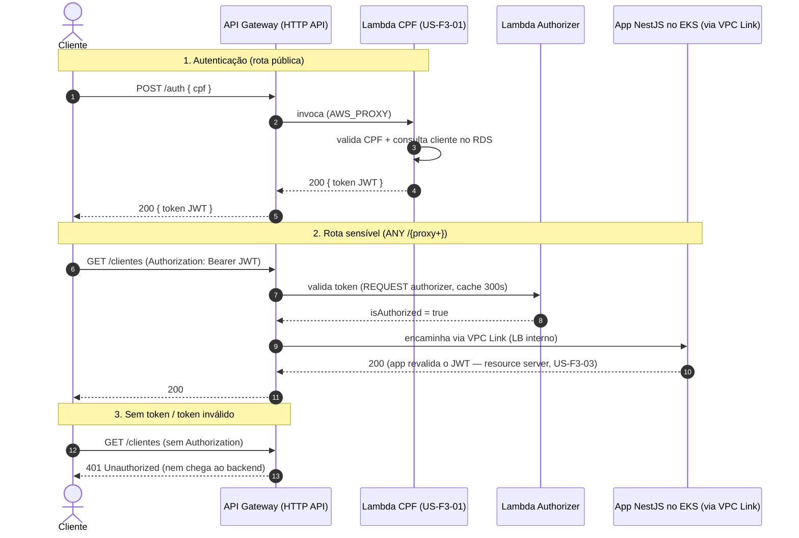

# Stage 03 — API Gateway (US-F3-02)

Provisiona o **AWS API Gateway (HTTP API v2)** como **entrada única** das APIs
da oficina:

- `POST /auth` público, integrado à **Lambda de autenticação por CPF**
  ([US-F3-01](https://github.com/guilhermeqmaia/soat-fiap-oficina-mecanica-app/blob/main/docs/user-stories/f3-01-serverless-cpf-auth.md));
- **rotas sensíveis** exigem JWT válido, checado por um **Lambda Authorizer**
  (a mesma function da autenticação, com handler de authorizer) antes de
  encaminhar ao backend;
- backend (NestJS no EKS) alcançado por **VPC Link** para um load balancer
  **interno** — só o gateway tem URL pública; a aplicação não é acessível por
  fora da VPC (sem bypass do gateway);
- **throttling**, **CORS** e **access logs JSON** no CloudWatch (insumo da
  [US-F3-10](https://github.com/guilhermeqmaia/soat-fiap-oficina-mecanica-app/blob/main/docs/user-stories/f3-10-observabilidade-apm.md)).

> **Origem (US-F3-07):** stage desenvolvido no repo da aplicação
> ([soat-fiap-oficina-mecanica-app](https://github.com/guilhermeqmaia/soat-fiap-oficina-mecanica-app),
> PR #46) e migrado para cá na segregação em 4 repositórios.
>
> **Por que AWS API Gateway (e não Kong/Traefik in-cluster)?** Decisão
> registrada em ADR ([f3-doc-02](https://github.com/guilhermeqmaia/soat-fiap-oficina-mecanica-app/blob/main/docs/user-stories/f3-doc-02-adrs.md)).
> **Por que HTTP API (e não REST API)?** Access logs sem a role de conta do
> CloudWatch (que não podemos criar no AWS Academy), CORS/throttling nativos,
> VPC Link para ALB/NLB interno e custo menor.

## Fluxo de autenticação



## Mapa de rotas

Espelha os endpoints `@Public()` do monólito — tudo que não está listado cai no
catch-all protegido.

| Rota | Destino | Proteção |
|---|---|---|
| `POST /auth` | Lambda CPF | pública |
| `GET /health`, `GET /health/ready` | EKS | pública (healthcheck) |
| `GET /ordens-servico/numero/{numero}/status` | EKS | pública (cliente acompanha a OS) |
| `POST /webhooks/ordens-servico/{id}/aprovacao` | EKS | pública (token/HMAC na app) |
| `GET /webhooks/ordens-servico/{id}/aprovar` e `/rejeitar` | EKS | pública (link de e-mail) |
| `ANY /{proxy+}` (todo o resto) | EKS | **JWT via Lambda Authorizer** |

## Pré-requisitos (outputs de outras stories)

| Variável | Vem de |
|---|---|
| `auth_lambda_arn` | US-F3-01 (repo `oficina-auth-lambda`) |
| `backend_listener_arn` | US-F3-05/06 — listener do ALB/NLB **interno** do EKS |
| `vpc_link_subnet_ids` | US-F3-05 — subnets privadas da VPC do EKS |
| `vpc_link_security_group_ids` | US-F3-05 — SG com egress para o LB interno |

## Como aplicar (AWS Academy)

Credenciais temporárias do Learner Lab (AWS Details → CLI) em
`~/.aws/credentials` ou via `AWS_ACCESS_KEY_ID` / `AWS_SECRET_ACCESS_KEY` /
`AWS_SESSION_TOKEN`. Região fixa `us-east-1`.

```bash
cd gateway
cp terraform.tfvars.example terraform.tfvars   # preencha com os outputs reais
terraform init
terraform apply

# URL pública do gateway (documentar no README do repo):
terraform output -raw api_base_url
```

## Configurações de borda

| Item | Default | Variável |
|---|---|---|
| Throttling | 20 rps / burst 40 (todas as rotas) | `throttling_rate_limit` / `throttling_burst_limit` |
| CORS | `*` (demo) | `cors_allowed_origins` |
| Cache do authorizer | 300 s por header `Authorization` | `authorizer_cache_ttl_seconds` |
| Access logs | JSON em `/aws/apigateway/oficina-mecanica-gateway`, 7 dias | `log_retention_days` |

## Qualidade

```bash
terraform fmt -check && terraform init -backend=false && terraform validate
```

## ⚠️ Notas (AWS Academy)

- Nenhuma IAM role é criada (o Academy só permite usar a `LabRole`): o HTTP
  API não precisa de role para access logs e as `aws_lambda_permission` são
  resource-based policies na Lambda.
- A sessão do Learner Lab expira (~4h): o `tfstate` local permanece válido,
  basta renovar as credenciais antes de `plan`/`apply`.
